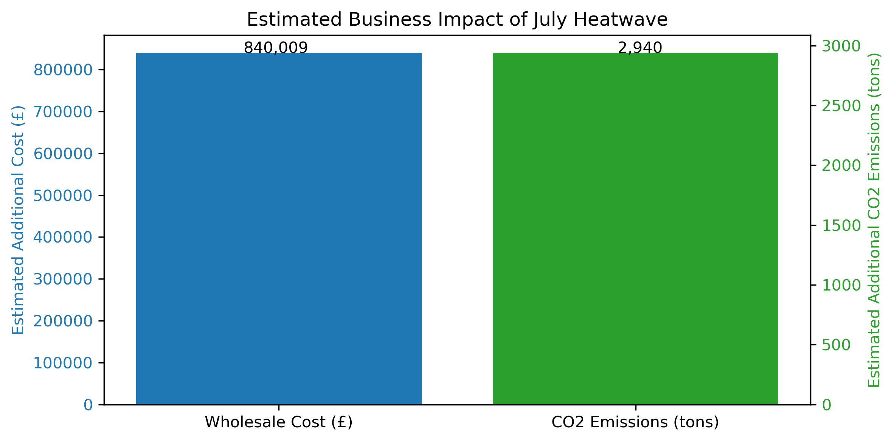

# Weather-Driven Electricity Demand Causal Analysis

This project investigates how extreme weather events, specifically heatwaves, impact electricity demand in Great Britain. 

It combines **causal inference** techniques with **real-world weather and demand data** to quantify both statistical effects and business costs.

---

## Project Overview

**Motivation**

- Energy grid operators need to understand how unusual weather affects demand.
- Traditional forecasting models often capture only correlation, not causation.
- Quantifying causal impacts enables better risk management, cost planning, and sustainability reporting.

**Goals**

1. Estimate the causal impact of a heatwave on hourly electricity demand.
2. Identify temporal causal relationships among weather variables and demand.
3. Translate uplift into monetary costs (£) and CO₂ emissions (tons).

---

## Methods and Tools

This project uses the following methods and libraries:

| Method                                 | Purpose                                                 |
|----------------------------------------|---------------------------------------------------------|
| **Bayesian Structural Time-Series (BSTS)** | Estimate counterfactual demand without the heatwave    |
| **PCMCI Causal Discovery (Tigramite)**    | Identify lagged dependencies among variables           |
| **ARIMA and Prophet Baselines**           | Benchmark predictive performance                       |
| **Python Libraries**: `causalimpact`, `tigramite`, `statsmodels`, `Prophet`, `pandas`, `matplotlib`, `networkx`, `seaborn` | Analysis and visualisation |

---

## Repository Structure
```
├── 01_scrape_weather.ipynb # Load and clean weather and demand data
├── 02_data_cleaning_and_baselines.ipynb
│ ├── Align time series
│ ├── Feature engineering
│ └── Fit ARIMA/Prophet baseline forecasts
├── 03_causal_impact_bsts.ipynb
│ ├── Train BSTS model
│ ├── Estimate counterfactual
│ └── Quantify causal uplift
├── 04_causal_discovery_pcmci.ipynb
│ ├── Identify lagged causal relationships
│ └── Visualise temporal causal graph
├── 05_translate_uplift_costs.ipynb
│ ├── Estimate financial and CO₂ impacts
│ └── Summarise findings
├── data_processed/
│ └── Parquet files, forecasts, outputs
└── data_raw/
  └── Scraped data
```

---

## Key Results

### Causal Impact of Heatwave (2025-06-30 to 2025-07-01)

- **Estimated uplift in demand**: +14,000 MWh
- **95% credible interval**: ~[-12,000, +37,000] MWh
- **Interpretation**: Although the uplift was **not statistically significant** at $p < 0.05$, the potential impact is significant over time.

### Estimated Business Impact

| Metric               | Estimate         |
|----------------------|------------------|
| Wholesale Cost       | ~£840,000        |
| CO₂ Emissions        | ~294 tons        |

> **Note:** Based on a marginal cost of £60/MWh and CO₂ intensity of 0.21 tCO₂/MWh.

### Temporal Causal Relationships (PCMCI)

- **Strong autocorrelation**: demand is primarily explained by its own history (lags 1-24 hours).
- **Weak cross-variable links**: limited direct effect of temperature or humidity after adjusting for autoregression.
- **Implication**: Exogenous weather variables play a secondary role in short-term forecasting.

---

## Visual Highlights



*Estimated uplift in demand and associated costs.*

---

## Business Takeaways

- Even moderate heatwaves can create substantial **incremental costs** and **emissions**, underscoring the need for proactive planning.
- Causal models (BSTS) provide a more robust estimation of impact than traditional forecasting alone.
- Temporal causal discovery helps validate which predictors matter most.

---

## Applications

This approach is applicable for:

- **Grid forecasting teams**: improve operational readiness.
- **Energy traders**: quantify risk exposure during extreme weather.
- **Sustainability reporting**: estimate environmental impact.
- **Policy analysis**: assess climate resilience strategies.

---

## Future Work

- Extend analysis across **multi-year datasets**.
- Incorporate **non-linear causal discovery** (e.g., GPDC).
- Model **scenario sensitivity** under varying energy prices.
- Evaluate **demand response interventions** during heatwaves.

---

## How to Reproduce

1. Install dependencies:
- pip install -r requirements.txt

- *(You may need `prophet`, `causalimpact`, `tigramite`, `statsmodels`, `networkx`, `seaborn`.)*

2. Run notebooks sequentially:
- `01_scrape_weather.ipynb`
- `02_data_cleaning_and_baselines.ipynb`
- `03_causal_impact_bsts.ipynb`
- `04_causal_discovery_pcmci.ipynb`
- `05_translate_uplift_costs.ipynb`

3. Outputs and saved data will appear in `data_processed/`.
        
---

## Acknowledgments

- **Open-Meteo API** for weather data.
- **National Grid ESO API** for GB demand.
- **Jakob Runge & Tigramite** for PCMCI implementation.
- **Google CausalImpact** for Bayesian structural time series modeling.

---

## Contact

*Author: Alejandro Ito Aramendia*  

---